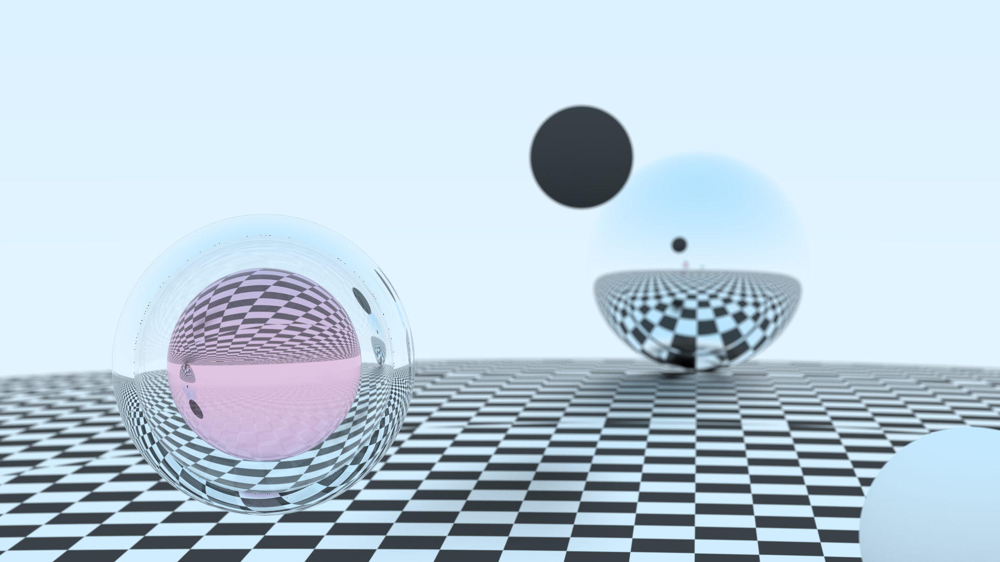

# Raytracer

A raytracer written in rust to learn the basic mechanics.

Roughly follows the structure implemented with [Raytracing in One Weekend](https://raytracing.github.io/books/RayTracingInOneWeekend.html).
